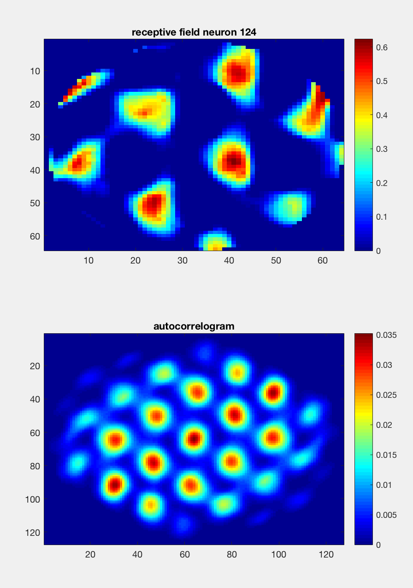
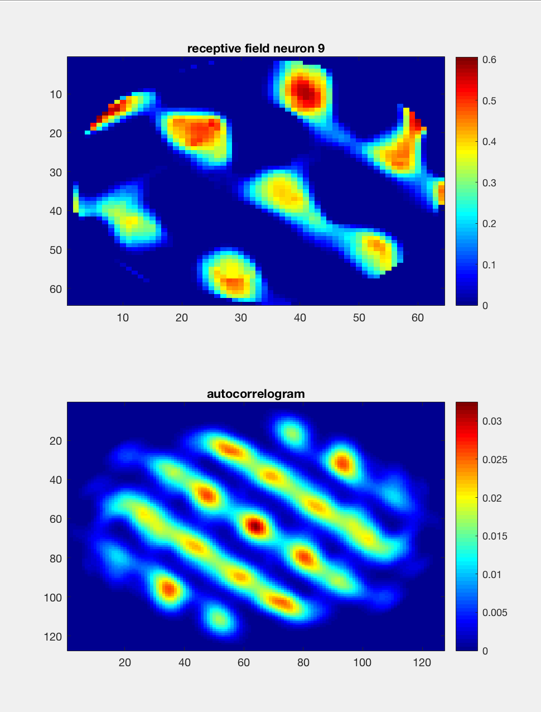

# Grid_Cell_simulation

Simulating a grid cell model based on a rodents random walk on a circular environment and a specific learning algorithm for connections, with a head direction network and a place_cell network connected via another network with random initial connection which then appear to get the Grid Cell like receptive field in the simulation.

simulations are based on a paper by Alessandro Treves in this link:
https://arxiv.org/abs/1203.3966

the simulation was done using java language, and the results were after processed and viewed using matlab, which I privided both codes in this repoitory.

this is a sample data produced by the model, it's the receptive field of a neuron which has shaped a grid cell.
Receptive field and Autocorrelogram are shown below:

>input images:

  
  

